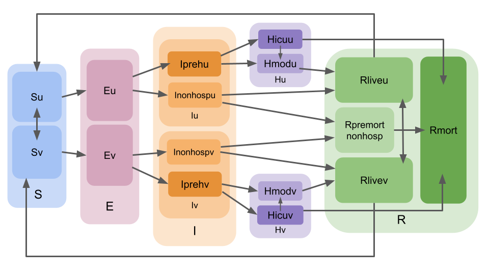

# Compartmental model used in LEMMA

We can talk about anything we want here because it's in the markdown file `LEMMA/inst/shiny/src/SEIRModel.md`, including stan implementation, assumptions, etc etc.

## FAQ 
[https://localepi.github.io/LEMMA/articles/faq.html](https://localepi.github.io/LEMMA/articles/faq.html)

