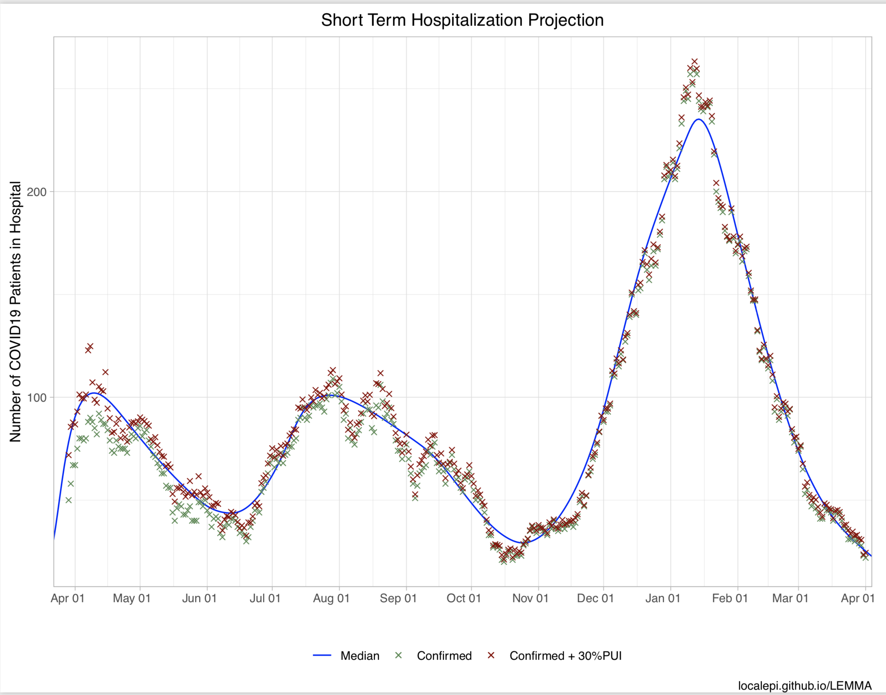
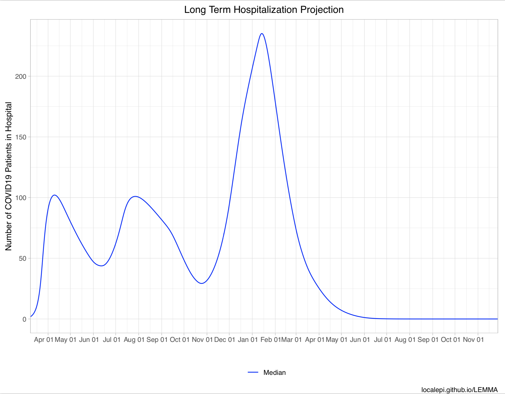

## Output 
Previous versions of LEMMA calculated crediblity intervals and reported quantiles. The current version only calculates a point estimate by maximizing the joint posterior. Future versions may include crediblity intervals again as an option.

### PDF output
The main output is provided in pdf format. Plots include short term and long term projections for number hospitalized, in the ICU, cumulative deaths, new hospital admissions, detected cases and seroprevalence (these are only shown for categories in which data was entered on the Data sheet). A plot of Re over time is shown up to 14 days before the last observed data. It is difficult to estimate Re beyond that date because it takes at least two weeks for changes in Re to be reflected in hospitalizations.

Detailed outputs are provided in Excel format.  

### Sheet 1: Projection 
The outputs on the "projection" sheet are all raw values, except seroprev and rt.

- hosp: hospital census  
- icu: ICU census  
- deaths: cumulative deaths  
- admits: new admits  
- cases: new detected cases [to match the cases inputs]  
- seroprev: fraction (0 to 1) of population with natural or vaccine immunity  
- rt: effective reproductive number  
- exposed: number currently exposed  
- infected: number currently infected  
- activeCases: true cases (not just detected) - exposed, infected, hospitalized  
- totalCases: true cases (not just detected) - ever exposed/infected/hospitalized [could include reinfections] + deaths  
- susceptibleUnvax: susceptible and unvaccinated  
- vaccinated: number with vaccine immunity  

### Sheet 2: posteriorParams
Posterior mode for each parameter (except interventions).

### Sheet 3: posteriorIntervention
Posterior mode for each interventions parameter.

### Sheet 4: all.inputs
Text dump of all inputs