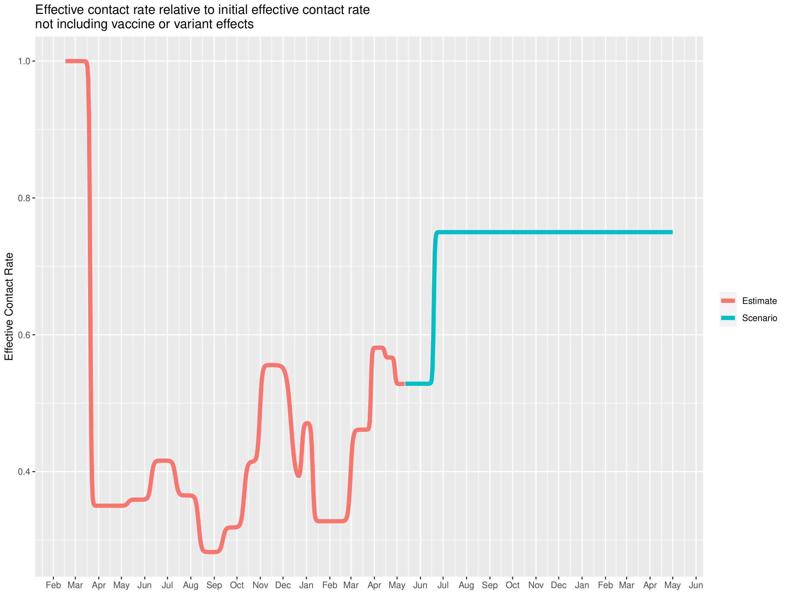

# Scenarios

Select a California county and run a potential scenario. The model is fit in the same manner as described on the "Forecasts" tab, and then is sampled to project a possible scenario. The scenario parameters under user control are listed below.

  * **Vaccine uptake**: select vaccine uptake proportion (vaccination will continue in model until this uptake percentage is reached) for each age group. Values outside of [0,100] will be clipped to those min/max values.
  * **UK variant growth**: select the growth rate of the B.1.1.7 variant of SARS-CoV-2 as a percentage; 0 corresponds to no growth relative to other variants (wild type), 1 corresponds to a growth rate equal to twice the wild type variant.
  * **BR variant growth**: select the growth rate of the P.1 variant of SARS-CoV-2, also specified as a percentage.
  * **Reopening**: the proportion of pre-pandemic activity that will be returned to after full reopening
  * **Detailed vaccine availability**: if "no", daily vaccine availability is set to the "baseline" amount, the number of vaccines available the last day for which data exists. Set this to "yes" to get access to more options on daily vaccine availability, given below:
    * **Daily increase in available doses (mRNA vaccines)**: the daily rate of increase (decrease) in available mRNA (Pfizer & Moderna) vaccine doses.
    * **Daily increase in available doses (J&J vaccine)**: the daily rate of increase (decrease) in available Johnson & Johnson vaccine doses.
    * **Increase over baseline for maximum daily doses (mRNA vaccines)**: by default, maximum daily doses are set to the amount available the last day for which data exists, for increasing daily availability, the maximum daily doses should be increased over baseline by this amount.
    * **Increase over baseline for maximum daily doses (J&J vaccines)**: the same option, but for J&J vaccines.

### Run Scenario  

After selecting the settings, the scenario can be run. Please make sure valid options have been selected for the scenario, otherwise nothing will happen. After clicking **Run Scenario** please wait a few minutes while the app downloads the most recent case data and runs scenarios with LEMMA. After the model has finished, PDF and Excel results can be downloaded by clicking the buttons **Download PDF output** and **Download Excel output**.

For additional functionality which is not practical to run from a web-based interface, please consider looking at [LEMMA-Forecasts](https://localepi.github.io/LEMMA-Forecasts/), an R package which this Shiny app depends upon and has additional functions, including generation of statewide overviews and maps of county-wise estimated effective reproductive number.

### PDF output

PDF output from running scenarios is slightly different from Forecasts or the basic Excel interface. The Excel output is unchanged.

The PDF output contains 9 plots:

  1. Effective contact rate relative to initial effective contact rate: this plot shows the estimated changes in effective contact rate, due to social distancing measures and other behavioral changes in orange. The blue section gives the projected changes in effective contact rate used for the scenario (controlled by the **Reopening** slider).
  2. Actual and Projected Vaccine Doses: this shows distributed vaccine doses and projected changes used for the scenario (affected by the **Daily increase in available doses (mRNA/J&J vaccine)** sliders and **Vaccine uptake** proportions).
  3. Relative fraction of COVID-19 cases belonging to each variant (controlled by **UK/BR variant growth** sliders).
  4. Long Term Hospitalization Projection
  4. Long Term ICU Projection
  5. Long Term Death Projection
  6. Long Term Hospital Admissions Projection
  7. Long Term Cases Projection
  8. Long Term Seroprevalence Projection

### Excel output

Detailed outputs are provided in Excel format.  

#### Sheet 1: Projection 
The outputs on the "projection" sheet are all raw values, except seroprev and rt.

- hosp: hospital census  
- icu: ICU census  
- deaths: cumulative deaths  
- admits: new admits  
- cases: new detected cases [to match the cases inputs]  
- seroprev: fraction (0 to 1) of population with natural or vaccine immunity  
- rt: effective reproductive number  
- exposed: number currently exposed  
- infected: number currently infected  
- activeCases: true cases (not just detected) - exposed, infected, hospitalized  
- totalCases: true cases (not just detected) - ever exposed/infected/hospitalized [could include reinfections] + deaths  
- susceptibleUnvax: susceptible and unvaccinated  
- vaccinated: number with vaccine immunity  

#### Sheet 2: posteriorParams
Posterior mode for each parameter (except interventions).

#### Sheet 3: posteriorIntervention
Posterior mode for each interventions parameter.

#### Sheet 4: all.inputs
Text dump of all inputs